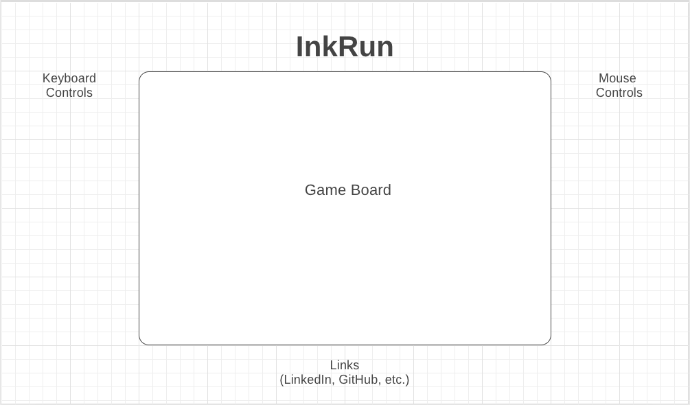

# JS Project Proposal: InkRun

## Background

InkRun is a 2d platformer where the player must guide their character from a starting zone to the goal of each level by using their mouse to draw terrain that interacts with the player character and obstacles. Some obstacles may interact with the player's drawn terrain and the player's drawing ability is limited by an ink gauge that depletes as they draw.

## Functionality and MVP

InkRun players will be able to:

- [ ] Start, pause, reset, and select any level they have unlocked in the current playthrough
- [ ] Move their character side to side and perform a short jump
- [ ] Draw terrain with the mouse so long as their ink gauge is not depleted

Potential bonus features include:

- [ ] Audio controls that allow the player to mute music and sound effects and choose a different background track.
- [ ] Additional customization options such as character sprite selection and alternate brush shape, thickness, and color.

## Wireframes

The app will consist of a single screen with game board, game controls, and nav links to the GitHub repository as well as my LinkedIn, and other relevant links. Keyboard controls (WASD for movement, Space to jump) are located on the left hand side. Mouse controls (left click to draw). 

Game controls in the top left corner of the game board let the player pause the game, restart the level, or go back to the level select screen. The Ink Gauge is located in the bottom right hand corner of the game board.

## Architecture and Technologies

The project will be implemented with the following technologies:

* `HTML` and `CSS` to host the game.
* `Javascript` for game logic.
* `webpack` to bundle js files.

## Implementation Timeline

**Day 1**: Setup the app structure, including webpack. Write a basic entry file and begin implementing drawing logic and basic control logic.

**Day 2**: Implement basic gravity physics and interactions with drawn terrain to get basic gameplay down.

**Day 3**: Make adjustments to game logic for a smooth gameplay feel.

**Day 4**: Touch up styling to create a presentable and eye-catching interface.
